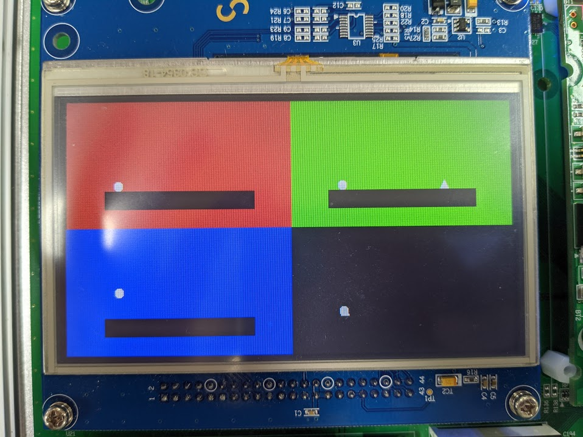
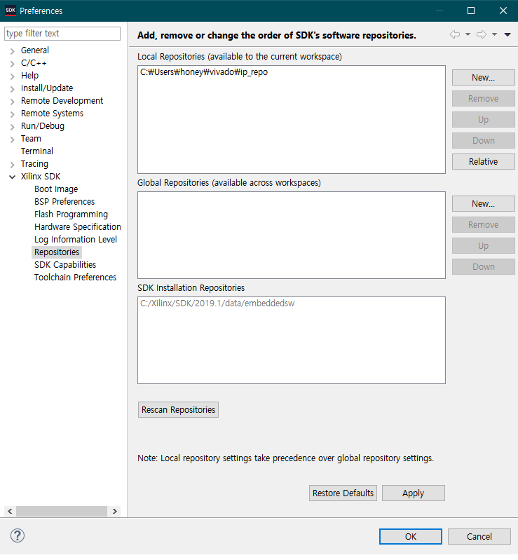
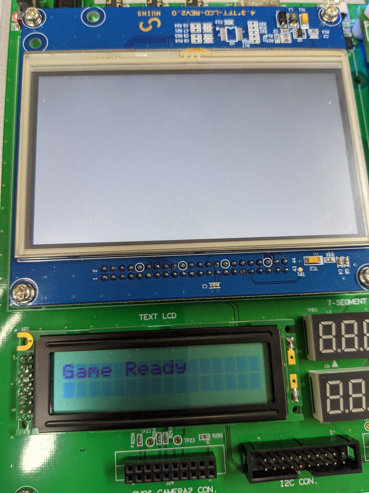
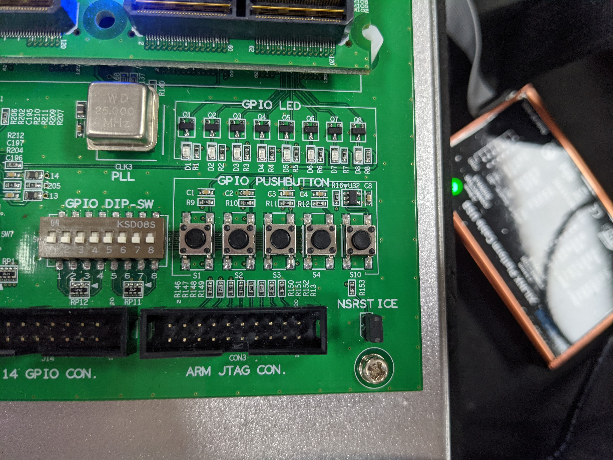
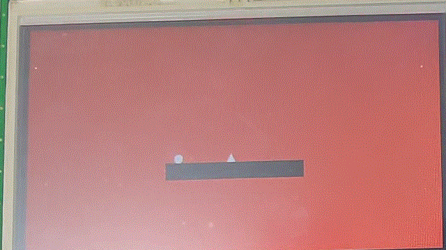
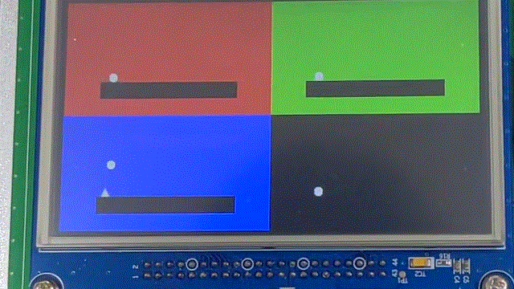
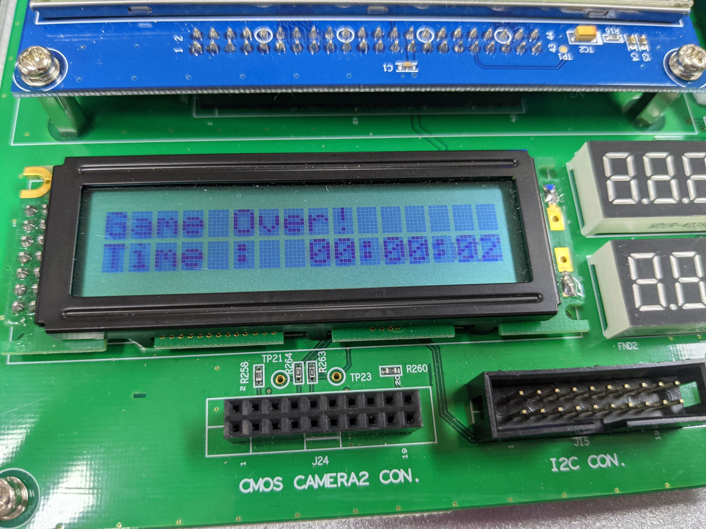

# [2021.1] SoC 텀 프로젝트: Core

| Name  | Github Link |
|-------|--------|
| 손원락 | [@dnjsfkr95](https://github.com/dnjsfkr95) |
| 윤대헌 | [@Greathoney](https://github.com/Greathoney) |
| 이승준 | [@dmssud002](https://github.com/dmssud002) |

## Introduction

- 여러 개의 공을 점프 시켜 가시 피하기
- 한번 가시에 닿으면 게임 오버
- 오래 살아남아 높은 점수를 기록

[텀 프로젝트 계획서](https://github.com/greathoney/core/reports/soc_play.pdf) 
(계획서와 실제 구현 요소와 다를 수 있음)

## Game play

## Prerequisite

Vivado 2019

## How to Play

Core를 실행해보려면 SDK path에서 ip_repo 폴더가 절대 경로라서, 업데이트 해 주어야 합니다.

SDK에서 디버깅 버튼을 누르면 실행하게 되고 FPGA에 성공하면 TFT-LCD에 하얀 화면이 나오고 TXT-LCD에 Game Ready가 나온다.

아래 사진 버튼에서 왼쪽으로 부터 1, 2, 3, 4번인데 1번을 누르면 게임이 시작하게 된다.

가시에 닿으면 게임오버가 되고, TXT-LCD에 게임 플레이한 시간(점수)가 출력된다.

